# Windows Installation For Vscode

* Download vscode: Go to [Visual studio code website](https://code.visualstudio.com/docs/?dv=win64user)

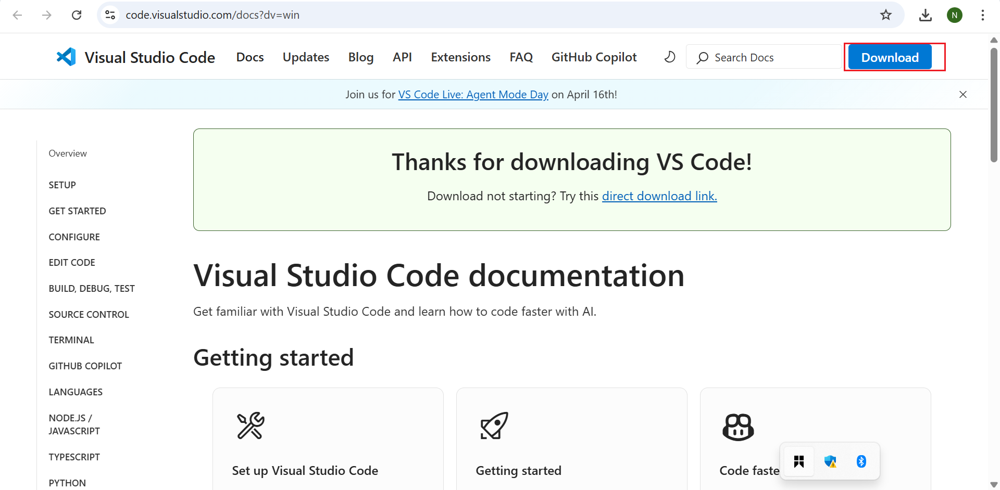

* On the web page, click "Download for Windows".

* *Run Installer*: Locate the downloade.exe file, double-click to run the installer.

* *Wizard*: Click "Next" through the installation wizard. Click next to all the remaining prompt.

* *Install*: Lastly, click install to complete the installation. When installation is complete, click "FINISH" to complete the installation.

* *Launching Vscode*: Open the Start Menu and type vscode on windows app search.

If your installation is successful, it will have the following look after launching.

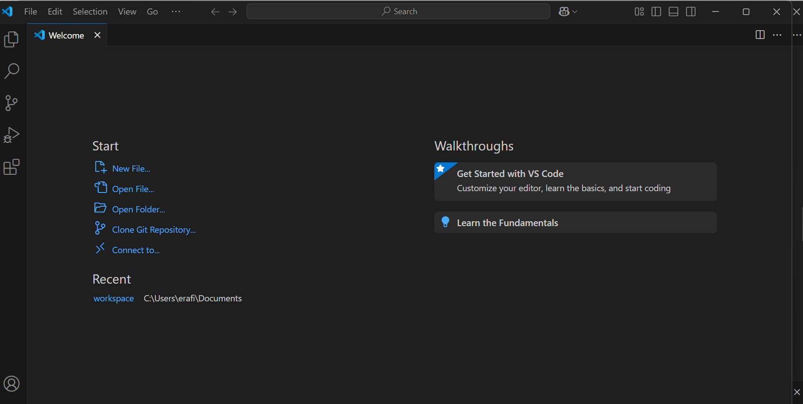

## Windows Installation For Git

* Download Git: Go to  [Git website for windows](https://git-scm.com/downloads/winr)

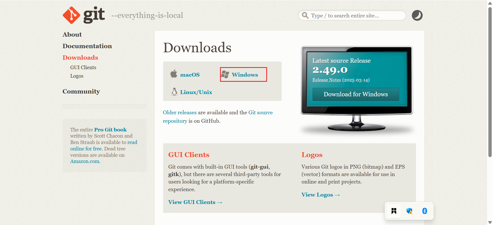

* On the webpage, click on download for windows. Ensure to select the latest version (2.49.0) 64-bit version of Git for Windows.

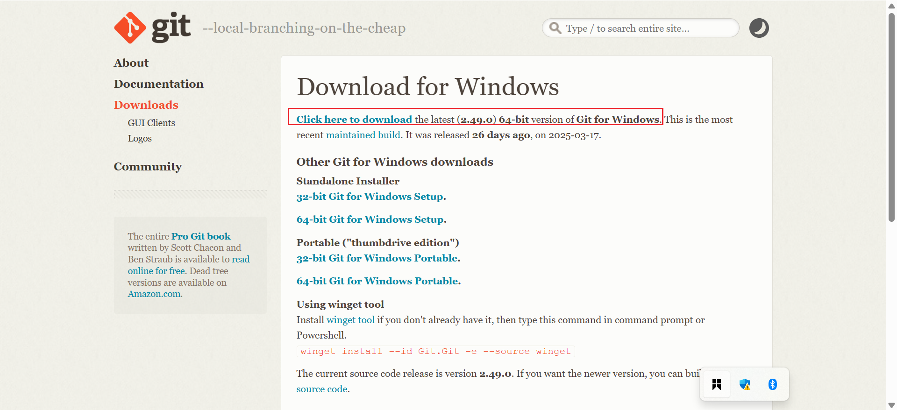

* Locate the downloaded file and double-click to run the installer.

* Lastly, click install to complete the installation. When installation is successful, click on FINISH.

* Launch Git by  clicking on the start menu on your desktop.

* If successful, you will see something similar to the picture below.

## Windows Installation For Virtual Box

* Download Virtual box: Go to  [Oracle virtual box website](https://www.virtualbox.org/) 

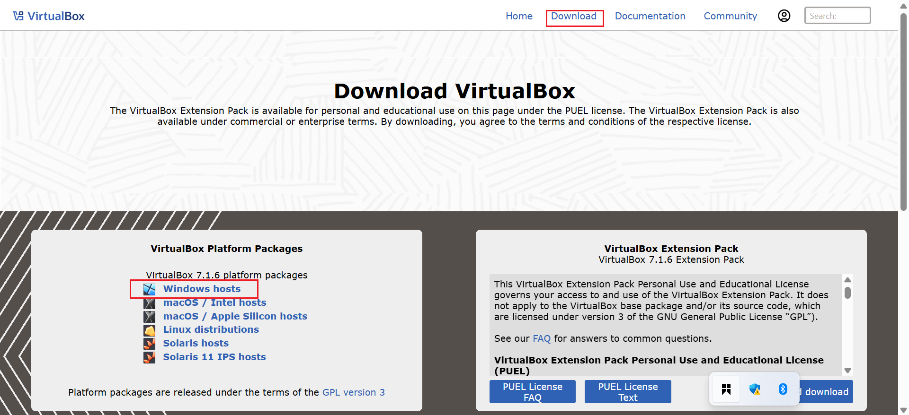

* Click on download and select windows host version.

* *Run Installer*: Locate the downloade.exe file, double-click to run the installer.

* *Wizard*: Click "Next" through the installation wizard. Click next to all the remaining prompt, leave every option to "default".

* *Install Virtual box*: Lastly, click install to complete the installation. Once installation is completed, click on "FINISH".

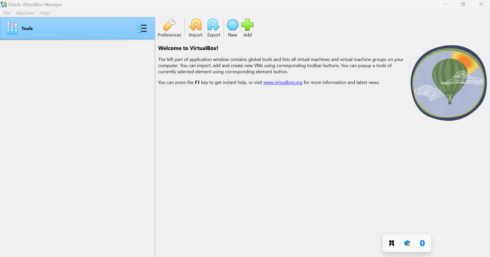

# Ubuntu Desktop ISO file

* Download Virtual box: Go to  [Ubuntu official website](https://ubuntu.com/download/desktop) 

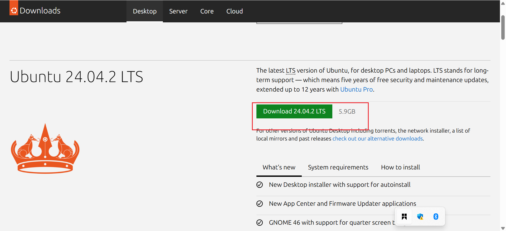

* Launch the already installed virtual box.

* Create a new virtual machine by clicking "NEW".

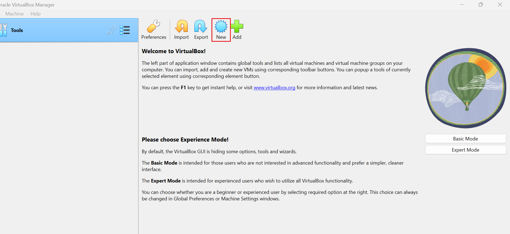

* Chose Linux as the type, and ubuntu as the version. Allocate at least 2gb of ram for the virtual machine.

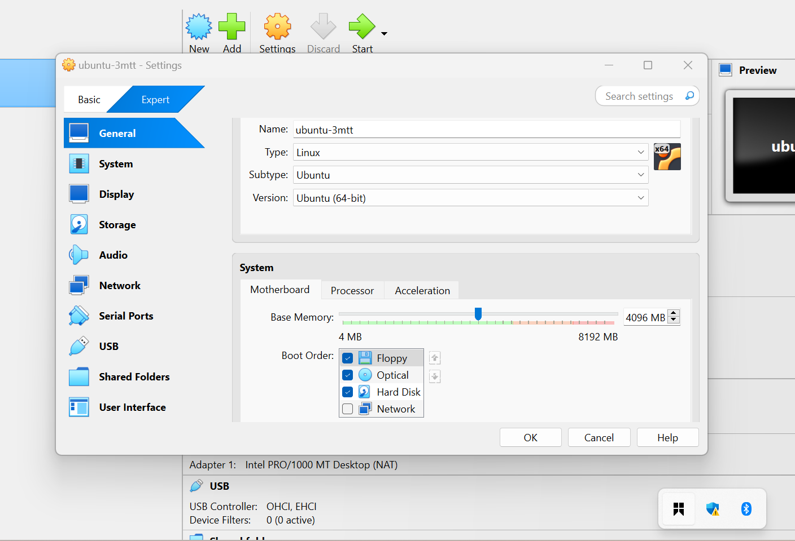

* Create a virtual hard disk, choose the ubuntu iso file that was downloaded from the website and check live cd/dvd.

* Click on start and your virtual machine will begin to run. Aprompt will appear like the emage below. Use the enter key to continue and also integrate your mouse as requested.

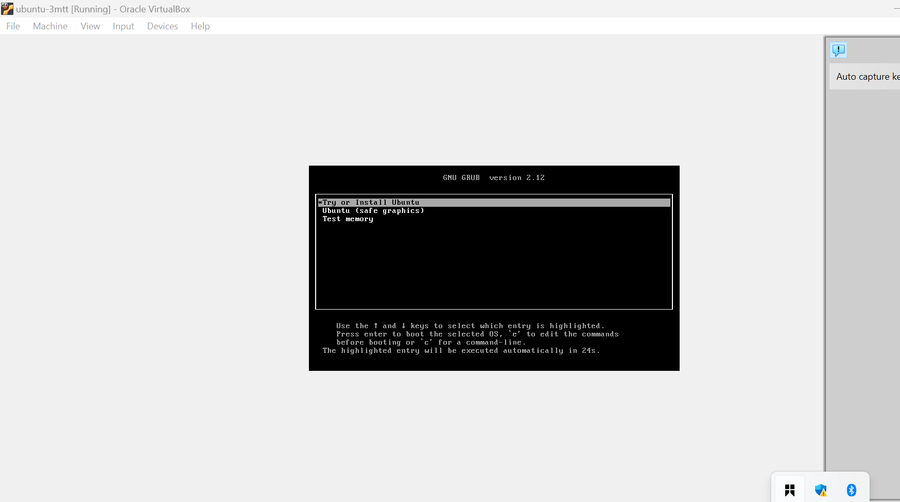

* Ensure to check erase disk desktop and install.

* *Note:* The installation mignt take a while to copy file and install to the system.

* Add your login credentials

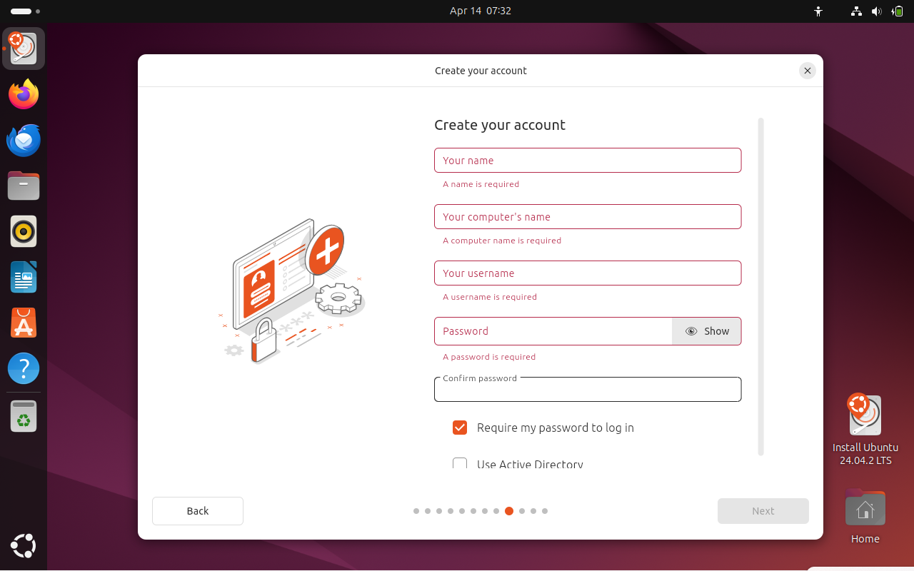

* After installation is completed, remove the installation media when prompted.

* Power off the virtual machine, and ubuntu will boot to desktop as shown below, then you can enter the login credentials you created during the installation. 

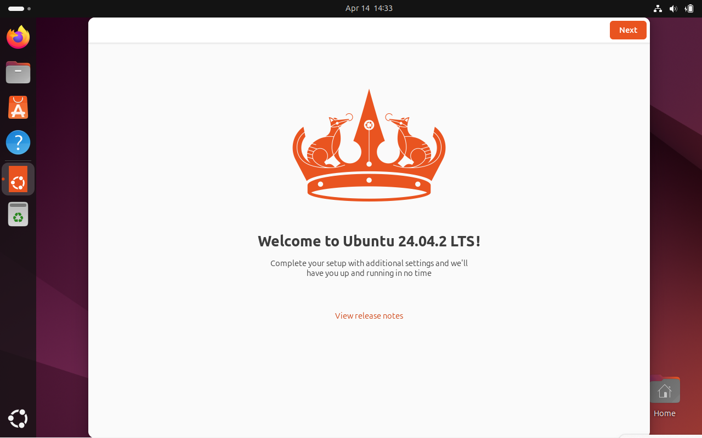

# Github Account

* Go to [Github website](https://github.com/)

* Click on Sign up to create an account.

* Fill out all the necessary informations like; username,email, and password.

* Next, you will be notified to verify your email address. Check your email box for the verification message from Github and click the verification link.

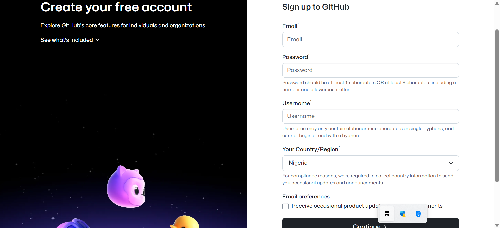

* *Complete the CAPTCHA*: Github may ask you to verify if you are a human by completing the "CAPTCHA". Follow the instructions to prove that you are a human.

* *Choose a plan*: Github offers free plans for public repositories and paid plans for private repositories. Choose the plan that best suits your needs. For beginners, the free plan is usually sufficient.

* *Welcome to Github*: Once you have completed the above steps, you will be redirected to a new git hub account. Congratulations! You now have a Github account.

* *Explore Github*: Take a few moments to explore the Github environment.

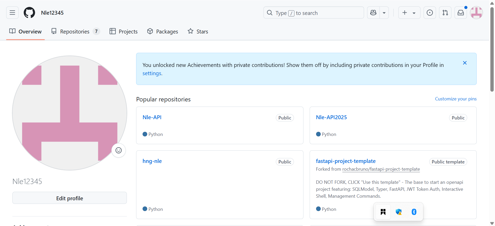

## Amazon Web Service (AWS) Account
* Visit the AWS tier page at [AWS website](https://aws.amazon.com/lightsail/?trk=2d3e6bee-b4a1-42e0-8600-6f2bb4fcb10c&sc_channel=ps&ef_id=CjwKCAjw--K_BhB5EiwAuwYoynVInnzpSLO_-VgtjYjyZ7FuMhRgFrvVbyK6skaYopsoHX_wzUd4qxoCo0wQAvD_BwE:G:s&s_kwcid=AL!4422!3!645125273261!e!!g!!aws!19574556887!145779846712&gclid=CjwKCAjw--K_BhB5EiwAuwYoynVInnzpSLO_-VgtjYjyZ7FuMhRgFrvVbyK6skaYopsoHX_wzUd4qxoCo0wQAvD_BwE) to learn about the services available, the free tier and the signup process.

* Click "*Create an AWS Account*": On the AWS Free Tier page, click on the create AWS account option.

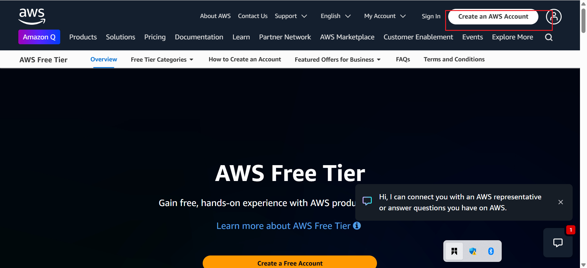

Sign in or create a new Amazon account. if you already have an Amazon account, you can sign in. If not, you will need to create a new one.

* Fill in the necessary details like address, email, username and payment details. Note that you will be required to provide a valid credit card information, even though you won't be charged unlessyou exceed the free tier limits. You will be required to have a minimum of 1 usd in your card.

* *Note*: Please note that if you are from an african country, you will need a virtual dollar card because most regular cards do not work.

* *Verify your identity*: This step may involve receiving a phone call or a verification code sent to your email or phone.

* *Choose a support plan*: AWS offers free support plan, but you might choose to upgrade to a higher plan. For beginners, thee free plan is usually sufficient.

* *Enter payment information*: As a part of the account setup, you will be required to enter your valid credit card details. Aws uses this for identity verification.

* *Review and confirm*: Review the information you provided, read the terms and conditions, and confirm your agreement.

*  It might take a while for the account to be approved. You will receive a confirmation email.

* *Access the AWS Management Console*: After receiving confirmation, log into the AWS Management Console Using your new account credentials.

* *Explore the AWS Free Tier services*: AWS offers a variety of services within the free tier, including EC2(Elastic Compute Cloud),S3(Simple Service Storage) and many more. Make sure to explore and understand their services.

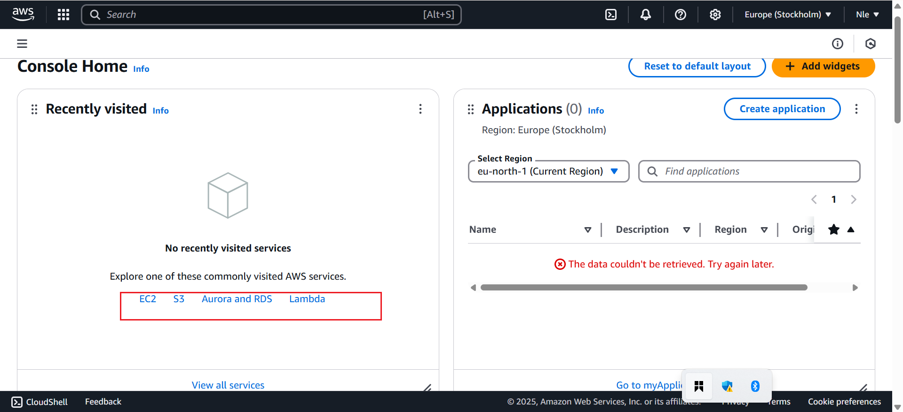